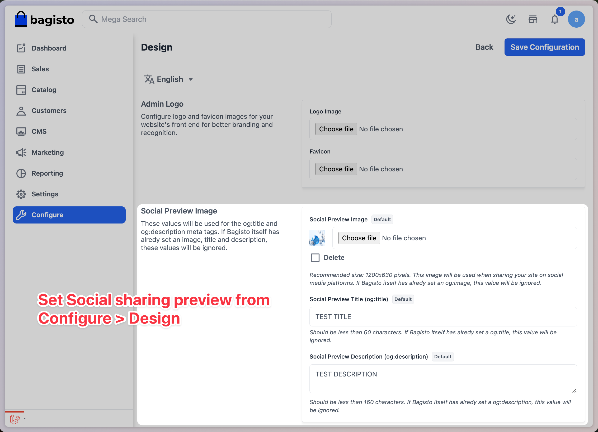

# OpenGraph Package for Bagisto

A Laravel package for [Bagisto e-commerce platform](https://bagisto.com/en/) that helps to set an [Open Graph](https://ogp.me/) image for better social media sharing.

## Purpose

This package allows you to easily add Open Graph meta tags to your Bagisto e-commerce pages. Open Graph protocol enables any web page to become a rich object in a social graph, making it more engaging when shared on social media platforms like Facebook, Twitter, and LinkedIn.

## Features

- Easy integration with Bagisto
- Dynamic Open Graph meta tag generation
- Inject meta tags only if not set by Bagisto (because Bagisto sets them for some pages)

## Installation

You can install the package via composer:

```bash
composer require ajaxray/opengraph
```
## Usage

Once the package is installed, you can set Social preview image in your Bagisto admin panel.
Go to `Configuration > Design > Social Preview Image` and set the image.



## Support
If you have any issues or questions, please open an issue at the [GitHub issues](https://github.com/ajaxray/bagisto-opengraph/issues).

## License
The MIT License (MIT). Please see [License File](LICENSE.md) for more information.

## Contributing
Thank you for considering contributing to the OpenGraph package! Please read our [Contribution Guidelines](CONTRIBUTING.md) for details.

## Security
If you discover any security-related issues, please email me directly at anis(dot)programmer(at)gmail(dot)com.
